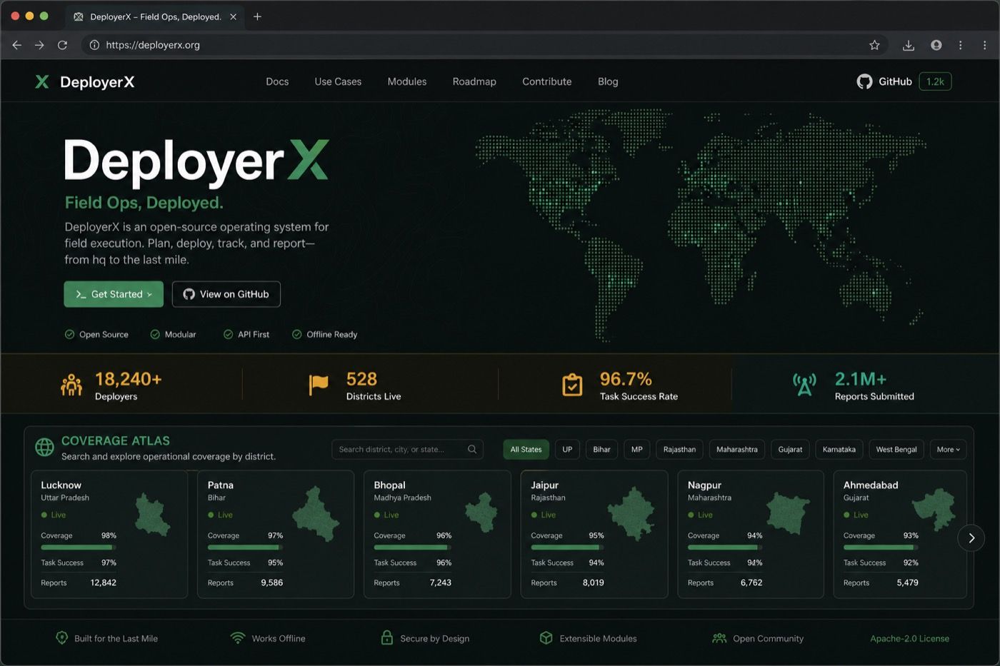

# DeployerX

Locale-aware playbooks for deploying AI with non-engineer operators.

**Live atlas:** https://anshul9t6.github.io/DeployerX/

[](https://anshul9t6.github.io/DeployerX/)

## What it is

DeployerX is an open-source field kit:

1. **Playbooks** — reusable deployment recipes (global)
2. **Locale packs** — country → admin L2 → admin L3 context (local deltas)
3. **Decisioning** — constraint questionnaire → recommended playbook + locale path

India is the reference implementation. The same tree shape applies to every country.

## Quick start

```bash
make status                 # where we are + refresh STATUS.md metrics
python3 -m decision.cli
python3 -m decision.resolve in uttar-pradesh varanasi
make check
```

**Session tracking:** [`STATUS.md`](STATUS.md) (today) · [`ROADMAP.md`](ROADMAP.md) (targets)  
**Start a city:** [`guides/city-start.md`](guides/city-start.md) · **What to deploy:** [`guides/deployments-50.md`](guides/deployments-50.md)

Path A (no paid APIs): open a playbook → browser model → human approval on the chat channel you already use.

| Playbook | Audience |
|----------|----------|
| [whatsapp-shop-faq](playbooks/whatsapp-shop-faq/) | Retail / local services |
| [clinic-whatsapp-faq](playbooks/clinic-whatsapp-faq/) | Clinics / labs (non-clinical FAQ only) |

## Architecture

```
playbooks/          # global recipes (do not fork per city)
locale-packs/
  _global/          # L0 defaults
  <cc>/             # L1 country
    l2/<slug>/      # L2 state/province/…
      l3/<slug>/    # L3 district/county/…  (deltas only)
decision/           # resolver + CLI
docs/               # GitHub Pages (reads docs/data/progress.json)
```

Cascade: `_global` → country → L2 → L3 (local wins).  
Contract: [`schema/hierarchy.md`](schema/hierarchy.md)

## Coverage

| Scope | Status |
|-------|--------|
| India L2 | 36/36 metas |
| India L3 | major cities seeded; PRs welcome |
| Brazil L2 | 27/27 estados + DF |
| Site stats | generated from repo via `scripts/generate_site_data.py` |

```bash
make site     # regenerate docs/data/progress.json
make check    # validate hierarchy + stale site data
```

## Contribute

Highest leverage: **L3 locale pack** for your district.  
See [CONTRIBUTING.md](CONTRIBUTING.md). Issue templates cover L3, country, and playbook PRs.

Project state for contributors/agents: [STATUS.md](STATUS.md) · [ROADMAP.md](ROADMAP.md)

## Ops

| Doc | Purpose |
|-----|---------|
| [STATUS.md](STATUS.md) | Where we are today / next |
| [ROADMAP.md](ROADMAP.md) | Phased targets |
| [AGENTS.md](AGENTS.md) | Rules for automated contributors |
| [field-notes/](field-notes/) | Deployment receipts |
| [SHARE.md](SHARE.md) | Launch copy (after a real field note) |

## License

MIT
